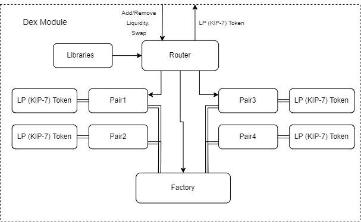

<!-- pdf parameters

---
urlcolor: #e3232c
linkcolor: #e3232c
---

-->

# TokeИest-DEX Specification<!-- omit in toc -->

<!-- start intro: only for github, remove if creating a pdf -->
#### 본 문서는 Klaytn-dex-contracts의 문서를 기반으로 작성되었으며, TokeИest의 스펙에 맞춰 재 정리된 문서입니다.

이 문서에서는 TokeИest DEX의 스마트 컨트랙트들의 핵심 기능들에 대해 자세한 설명을 제공하며, 보안 문제에 대해 논의하고 프로젝트에 대한 일반적인 정보를 제공합니다.

Farming과 Staking 컨트랙트는 TokeИest의 핵심 기능에 포함되는 기능이 아니기 때문에 추후 DEX 고도화 개발 시 컨트랙트 개발할 예정입니다.
  
## Contents<!-- omit in toc -->

- [Introduction](#introduction)
  - [Dex](#dex) 
  - [DEX platform](#dex-platform)
  - [Constant Product Formula](#constant-product-formula)
  - [Token Types](#token-types)
    - [ERC20](#erc20)
    - [KIP7](#kip7)
  - [Factory](#factory)
  - [Pair](#pair)
  - [Token Swap](#token-swap)
    - [`DEXswap`](#dexswap)
  - [Liquidity Pool](#liquidity-pool)
  - [Liquidity Provider](#liquidity-provider)
  - [Liquidity Provider Fee](#liquidity-provider-fee)
  - [Pool Tokens](#pool-tokens)
  - [Multisignature wallet](#multisignature-wallet)
- [Smart Contracts](#smart-contracts)
  - [Deployment Order](#deployment-order)
  - [Core](#core)
    - [`DexFactory`](#dexfactory)
      - [Factory Contract: Functions](#factory-contract-functions)
        - [`createPair`](#createpair)
    - [`DexPair`](#dexpair)
      - [Year 2038 Problem](#year-2038-problem)
      - [Pair Contract: Events](#pair-contract-events)
      - [Pair Contract: Functions](#pair-contract-functions)
        - [`mint`](#mint)
        - [`burn`](#burn)
        - [`swap`](#swap)
  - [Periphery](#periphery)
    - [`DexRouter`](#dexrouter)
      - [Adding Liquidity](#adding-liquidity)
      - [Removing Liquidity](#removing-liquidity)
      - [Swapping tokens](#swapping-tokens)
    - [`DexLibrary`](#dexlibrary)
      - [Library Contract: Functions](#library-contract-functions)
        - [`getAmountOut`](#getamountout)
        - [`getAmountIn`](#getamountin)
  - [Access](#access)
    - [`Ownable`](#ownable)
      - [`Ownable`: Functions](#ownable-functions)
    - [`AccessControl`](#accesscontrol)
      - [Roles](#roles)
        - [Admin role](#admin-role)
- [Security Concerns](#security-concerns)
- [Calculations](#calculations)

<!-- end intro: only for github, remove if creating a pdf -->

## Introduction

아래 정보는 프로젝트 설계에 대한 간략한 개요를 제공하고 문서 전체에서 사용되는 용어를 정의합니다.

### Dex

Dex는 자동화된 유동성 프로토콜입니다. [Dex는 정의된 공식](#constant-product-formula)으로 구동 되는 스마트 컨트랙트 시스템입니다. Dex는 사용자 정의가 가능한 시스템으로 설계되어 있기 때문에 **tokenomics가 정의되어 있지 않습니다.** Dex의 각 인스턴스는 자체의 tokenomics를 정의합니다.

### DEX platform

DEX 플랫폼은 클레이튼 블록체인을 위해 구현된 업그레이드가 불가능한 스마트 계약 시스템인 [DEX 프로토콜](#dex)을 다른 스마트 컨트랙트와 결합합니다.

### Constant Product Formula

Dex에서 사용되는 자동 시장 결정 알고리즘은 [Dex](#dex): `x * y = k` 공식으로 유동되는 풀의 각 쌍(`x`, `y`)의 곱(`k`)을 변경해서는 안 된다는 것을 나타냅니다.

### Token Types

[Dex 프로토콜](#dex)은 스마트 계약 내에서 대체 가능한 토큰에 대한 API를 구현하는 ERC20 및 KIP7 토큰 표준과 함께 작동합니다.

DEX에서는 디플레이션 토큰 및 전송 수수료가 있는 토큰이 지원되지 않습니다.

#### ERC20

[ERC20](https://eips.ethereum.org/EIPS/eip-20) (Ethereum Request for Comments 20)은 Fabian Vogelsteller가 제안한 토큰 표준으로, Dex는 모든 표준 ERC20 구현을 지원합니다.

#### KIP7

[KIP7](https://kips.klaytn.foundation/KIPs/kips-7)은 Klaytn의 대체 가능한 토큰 표준입니다. DEX는 모든 표준 KIP7 구현을 지원합니다.

### Factory

Factory는 ERC20/ERC20, KIP7/KIP7, ERC20/KIP7 또는 KIP7/ERC20 [Token pair](#pair)에 대한 고유의 스마트 컨트랙트를 배포하는 컨트랙트 입니다. 자세한 내용은 [`DexFactory` 컨트랙트](#dexfactory)를 참조하세요.

### Pair

Pair는 Dex Factory에서 배포한 스마트 컨트랙트로 두 개의 ERC20 또는 KIP7 토큰의 조합 간에 거래가 가능합니다. 자세한 내용은 [`DexPair` Contract](#dexpair)를 참조하세요.

### Token Swap

Dex의 토큰 스왑은 하나의 ERC-20 또는 KIP7 토큰을 다른 토큰과 교환하는 방법입니다. Dex의 각 토큰들은 [유동성 풀](#liquidity-pool)를 뒷받침해 동작합니다.

['DexPair'](#dexpair) 컨트랙트는 낮은 수준의 스왑 기능을 정의하며, [`DexRouter`](#dexRouter) 계약을 통해 스왑을 진행합니다.

#### `DEXswap`

DEX 컨트랙트([`DexPair`](#dexpair), [`DexRouter`](#dexrouter))는 DEXswap 토큰에서 `safeTransfer` 또는 `safeTransferFrom` 기능을 사용하지 않지만, DexSwap 토큰(`SafeTransfer` 및 `SafeTransferFrom` 기능)은 사용자가 다른 계약으로 토큰을 보낼 때 별도로 사용할 수 있습니다.

**Warning**: 이로 인해 DEX에서 처리하지 않는 컨트랙트에서 re-entrancy 공격이 발생할 수 있습니다.

`safeTransfer`와 `safeTransferFrom`은 `_checkOnKIP7Received` 함수의 수신자 주소에 extenal call 함수인 `onKIP7Received`를 호출하여 수신자 주소가 `KIP7Receiver`인지 확인합니다. 이 `onKIP7Received(recipient)` 호출은 약한 곳입니다. 수신자 컨트랙트가 임의의 실행 논리를 정의할 수 있는 미지의 컨트랙트에 대한 외부 호출이므로 `safeTransfer`와 `safeTransferFrom`을 사용하여 함수를 다시 입력할 수 있습니다.

사용자가 이 기능을 사용하려면 수신자 주소를 철저히 확인해야 하며, 본인이 보기에 의심스러워 보이지 않고 악성코드(미확인 컨트랙트)가 없는지 확인해야 합니다.

**Warning**: `approve`와 `transfer From`을 사용할 경우 이중지출이 발생할 우려도 있습니다. 공격을 피하기 위해 허용치 변경 시 먼저 허용치를 0으로 설정한 후 사용 여부를 확인한 다음 새 값을 설정합니다.

### Liquidity Pool
유동성 풀은 두 개의 고유 토큰의 잔액을 보유하고 입출금에 대한 규칙을 시행하는 스마트 계약입니다.

### Liquidity Provider

유동성 제공자는 토큰 쌍을 위해 2개의 ERC20 또는 KIP7 토큰에 해당하는 값을 [pool tokens](#pool-tokens)에 예치하고 그 대가로 [liquidity pool](#liquidity-pool)을 받습니다. 유동성 제공자는 가격 위험을 감수하고 수수료로 보상을 받습니다.

### Liquidity Provider Fee

유동성 공급자 토큰 교환 수수료는 유동성 보유액에 대한 기여도에 비례하여 유동성 공급자가 분할하는 0.3%입니다.

### Pool Tokens

유동성이 풀에 입금되면 유동성 토큰(LP 토큰)으로 알려진 고유 토큰이 발행되어 제공자의 주소로 전송됩니다. 이러한 토큰은 주어진 유동성 제공자의 풀에 대한 기여를 나타냅니다.

제공자가 받는 유동성 토큰의 수는 제공된 풀 유동성의 비율에 따라 결정되며, 자세한 내용은 [`mint`](#mint) 함수 설명을 참조하십시오.

### Multisignature wallet

다중 서명 지갑은 DEX의 다양한 행동에 대한 제안에 여러 당사자가 동의할 수 있는 컨트랙트 입니다. 컨트랙트를 통해 제안을 제출하고 확인할 수 있으며, 제안에서 확인(이전에 확인된 경우)을 취소할 수 있는 옵션도 있습니다.

일정한 수의 서명자가 동작을 확인하며 실행할 수 있으며, 지정된 조건, 즉 동작을 확인한 서명자의 수가 `min_required`보다 큰 경우 `confirmTransaction` 함수 호출 중에 자동으로 제안이 실행되며, 실패 시에는 수동으로 제안을 실행할 수도 있습니다.

## Smart Contracts

Dex는 핵심 컨트랙트와 주변 컨트랙트로 구성된 이진 시스템인 Uniswap V2 스마트 컨트랙트 시스템을 사용합니다. [Core contracts](#core)는 Dex와 상호 작용하는 모든 당사자에게 근본적인 안전을 보장합니다. [Periphery contracts](#periphery)는 하나 이상의 핵심 계약과 상호 작용하지만 그 자체는 핵심의 일부가 아닙니다.

<!-- pdf option: { width=400px } -->

설명은 [factory](#dexfactory), [pair](#dexpair), [router](#dexrouter), [library](#dexlibrary) 계약을 참조하십시오.

### Deployment Order

스마트 컨트랙트들을 배포하려면 아래 순서대로 실행하세요.

1. [Dex Factory](#dexfactory)
2. [Dex Router](#dexrouter)
3. [Multisig](#multisignature-wallet)
4. Dex Token
5. Swap
6. [Check for price fluctuations in TokeИest-NextJs Project](https://github.com/TokeNest/TokeNest_NextJs)

WKLAY의 경우 [TokeИest-dex-specification](#TokeИest-dex-specification)에서 소개한 것과 같이 TokeИest의 핵심 기능에 부합하지 않는 기능으로 고도화 개발 시 구현할 예정입니다. 현재 Test코드에서 기존 WKLAY의 부분은 제외했으며, 필요 시 [Klaytn-dex-contract](https://github.com/klaytn/klaytn-dex-contracts)를 참조하시기 바랍니다.


### Core

코어는 단일 facotry와 factory가 생성 및 인덱싱을 담당하는 많은 pair들로 구성됩니다. 코어 컨트랙트는 유니스왑이 존재하기 위해 필수적인 스마트 계약입니다. 새로운 버전의 코어로 업그레이드하려면 유동성 마이그레이션이 필요합니다.

**factory**(`DexFactory`)는 pair의 전원을 공급하는 일반 바이트 코드를 보유하고 있습니다. 주요 업무는 고유 토큰 pair당 하나의 스마트 컨트랙트를 만드는 것입니다.

**pairs**(`DexPair`) 컨트랙트는 자동화된 시장 결정자 역할과 풀 토큰 잔액을 추적하는 두 가지 주요 목적을 가지고 있습니다. 또한 분산된 가격 오라클을 구축하는 데 사용할 수 있는 데이터를 노출합니다.

#### `DexFactory`

Factory('DexFactory')는 ERC20/ERC20, KIP7/KIP7, ERC20/KIP7 또는 KIP7/ERC20 토큰 쌍에 대한 고유한 스마트 계약('DexPair')을 배포하는 스마트 계약입니다.

pair가 배포된 순서에 대한 정보는 생성된 모든 pair의 주소를 포함하는 배열인 `allPairs`를 통해 액세스할 수 있습니다.

Factory 컨트랙트는 또한 프로토콜 전체 요금 수령자를 관리하며, `feeTo`는 프로토콜 전체 요금의 주소를 정의하고, `feeToSetter`는 `feeTo`를 변경할 수 있는 주소를 정의합니다.

##### Factory Contract: Functions

<!-- github table -->

|          Function           |                                                                                                                                                           Description                                                                                                                                                           |
| --------------------------- | ------------------------------------------------------------------------------------------------------------------------------------------------------------------------------------------------------------------------------------------------------------------------------------------------------------------------------- |
| [`createPair`](#createpair) | TokeИest의 CriteriaCoins와 상품 토큰을 입력받아 두 토큰의 Pair가 존재하지 않을 시 Pair를 생성합니다.                                                                                                                                                                                                                                                                                             |
| `getPair`                   | Pair를 구성하는 두 토큰을 입력받아 Pair가 존재할 시 주소를 반환합니다.                                                                                                                                                                                                                                                                                             |
| `setFeeToSetter`            | 프로토콜 전체 요금 수취인(`feeTo` 주소)을 제어할 수 있는 주소를 설정합니다. 주소를 실수로 입력하면 프로토콜 전체 요금 수취인을 제어하기 때문에 요금 목적지에 대한 제어권을 잃게 됩니다.                                                                                                                                                                                                                                                                                             |
| `setFeeTo`                  | 제공된 주소를 허용하여 프로토콜 전체 요금 수신자를 제어합니다. `setFeTo`는 프로토콜 전체 요금 수신자의 새 주소를 설정하는 `feeToSetter`에서만 호출할 수 있습니다. `setFeeTo` 기능에서 잘못된 주소를 설정하면 프로토콜 전체 요금이 손실됩니다.                                                                                                                                                                                                                                                                                             |
| `allPairsLength`            | 생성된 Pair의 총 개수를 반환합니다.                                                                                                                                                                                                                                                                                             |
| `getCriteriaCoins`                   | TokeИest의 기준 코인을 가져옵니다.                                                                                                                                                                                                                                                        |
| `createCriteriaCoins`                   | TokeИest에서 사용할 기준 Stable코인을 지정합니다.                                                                                                                                                                                                                                                        |
| `getTokenValues`                   | pair배열을 파라미터로 받아 각 페어의 두 토큰간의 비율에 따른 가격을 계산해 반환합니다.                                                                                                                                                                                                                                                        |

###### `createPair`

TokeИest의 CriteriaCoins와 상품 토큰을 입력받아 두 토큰의 Pair가 존재하지 않을 시 Pair를 생성합니다. 사용자가 입력한 상품 토큰이 첫 번째 토큰으로 저장되고, CriteriaCoin이 두 번째 토큰으로 저장됩니다.

또한 함수가 실행되면 `PairCreated` event를 발생시키며 Pair생성 시 동일한 토큰 쌍으로 시도 시 생성되지 않습니다.
`pairCreated` 이벤트는 생성된 두 토큰의 주소, Pair의 주소, Pair의 기본 번호를 모두 포함하며, 전송된 이벤트의 첫 번째 토큰은 정렬 순서에 따라 항상 상품 토큰으로 저장되며, 두 번째 토큰이 CriteriaCoin이라는 점을 보장합니다.

#### `DexPair`
Pair ('DexPair')는 Factory(['DexFactory')에서 배포된 스마트 컨트랙트로 두 개의 ERC20 또는 KIP7 토큰의 조합 간에 거래가 가능합니다.

토큰 Pair에 대한 각 Dex 스마트 컨트랙트는 ERC-20/KIP-7 토큰 2개의 **reserves**로 구성된 [유동성 풀](#liquidity-pool)을 관리하며, 토큰 페어에 대한 최소 유동성은 `MINIMUM_LUIPIDITY` 상수를 통해 정의됩니다.

컨트랙트에는 두 토큰에 대한 적립금, 최신 블록의 타임스탬프, 두 토큰의 최근 누적 가격, 두 적립금의 곱으로 계산된 토큰 쌍의 `k`(k는 불변)값 등의 정보가 포함됩니다.

##### Year 2038 Problem <!--omit in toc-->

Pair contract들은 [Year 2038 Problem](https://en.wikipedia.org/wiki/Year_2038_problem)문제를 갖고 있습니다. 이 문제는 적립금과 물가 적립금을 갱신할 때 사용하는 `_update` 함수가 2038년에 마무리될 때 `block.timestamp`를 uint32로 캐스팅합니다.

이는 외부 가격 보고에 사용되는 `price0CumulativeLast` 및 `price1CumulativeLast` 변수(Pair 내 토큰의 최근 누적 가격)에만 영향을 미칩니다. 

이것은 DEX 기능에 문제를 일으키지는 않습니다. Pair 계약은 2038년 이후에도 여전히 작동하지만 잘못된 누적 가격을 보고하는 버그도 포함할 것입니다. 이 가격 보고 기능에 의존하는 다른 스마트 컨트랙트는 2038년 이후 올바르게 작동하지 않을 것입니다.

##### Pair Contract: Events

- 유동성 토큰이 [`mint`](#mint)를 통해 생성되면 토큰 Pair의 각 토큰의 송신자 주소와 양에 대한 정보와 함께 `Mint` 이벤트가 발생합니다.
- [`burn`](#burn)을 통해 유동성 토큰이 소멸되면 토큰 Pair의 발신인 주소, 토큰을 수신한 주소, 각 토큰의 양에 대한 정보와 함께 `Burn` 이벤트가 발생합니다.
- [`swap`](#swap)을 통해 토큰 간의 스왑이 발생하면 발신인과 수신인의 주소, 교환 및 수신된 토큰의 양과 함께 `swap` 이벤트가 발생합니다.
- [`mint`(#mint), [`burn`(#burn), [`swap`(#swap) 작업의 결과로 적립금이 업데이트되면 토큰 Pair의 두 토큰의 적립금 정보와 함께 `Sync` 이벤트가 발생합니다.

##### Pair Contract: Functions

<!-- github table -->

|    Function     |                                                                                     Description                                                                                      |
| --------------- | ------------------------------------------------------------------------------------------------------------------------------------------------------------------------------------ |
| `initialize`    | Pair 컨트랙트인 Initialize는 두 토큰의 주소를 받으며, [factory](#dexfactory)가 Pair 컨트랙트를 초기화 합니다. 이 함수는 Pair가 배포될 때 실행됩니다. |
| `getReserves`   | Pair에 reserve되어 있는 두 토큰의 주소와 최신 타임스탬프를 반환합니다.                                   |
| [`mint`](#mint) | 풀 토큰(LP 토큰)을 생성합니다.                                                                                                                                                                   |
| [`burn`](#burn) | 풀 토큰을 소멸시킵니다.                                                                                                                                                                  |
| [`swap`](#swap) | 토큰간 스왑을 진행합니다.                                                                                                                                                                          |


Recovery mechanisms:

<!-- github table -->

| Function |                                                                                                                                                          Description                                                                                                                                                          |
| -------- | ----------------------------------------------------------------------------------------------------------------------------------------------------------------------------------------------------------------------------------------------------------------------------------------------------------------------------- |
| `skim`   | 잔액을 reserve한 값과 일치 시킵니다. `skim`은 한 Pair로 전송되는 토큰의 양이 적립금의 저장소를 넘칠 정도로 많아 거래가 실패할 수 있는 경우를 대비한 복구 메커니즘입니다. `skim`을 사용하면 사용자는 현재 잔액과 reserve한 값의 차액을 인출합니다.                               |
| `sync`   | 잔액을 일치시키기 위해 reserve값을 강제로 설정합니다. `sync`는 토큰 중 하나가 비동시적으로 토큰 Pair의 잔액을 감소시키는 경우를 대비한 복구 메커니즘입니다. 이렇게 되면 거래는 차선의 비율을 받게 되고 어떤 공급자도 이 상황을 수정하려고 하지 않을 수 있으므로 이 Pair은 동작을 못할 수 있기 때문에 복구 메커니즘이 필요합니다. |

###### `mint`

`DexPair` 컨트랙트에서의 `Mint` 함수는 [DexRouter](#DexRouter) 컨트랙트를 통해 유동성이 추가될 때 토큰 Pair에 대해 호출되는 하위 함수로, `Mint`, `Sync`, `Transfer` 이벤트가 발생합니다.

처음 생성되는 풀인 경우거나 [LP 토큰](#pool-tokens)이 없다면, 유동성은 두 토큰의 mint된 양의 곱에서 `MINIMUM_LUIPIDY` 상수 값을 차감하여 계산됩니다:

```
sqrt(amount0 * amount1) - MINIMUM_LIQUIDITY
```

풀의 첫 번째 `MINIMUM_LIQUIDITY` 토큰이 영구적으로 잠깁니다.

위 상황이 아닌 풀에서 LP 토큰의 총 공급이 0이 아니면 유동성은 다음과 같이 계산됩니다:

1. 각 토큰의 mint된 양에 풀의 LP 토큰 수를 곱하고 이 토큰의 reserve값으로 나눕니다.
2. 다음 두 값 중 최소 값을 선택합니다:
   
   ```
   min((amount0 * _totalSupply) / _reserve0, (amount1 * _totalSupply) / _reserve1)
   ```

Minting 수수료는 설정되어 있을 때 다음과 같이 계산됩니다:
1. 두 토큰의 reserve값의 곱인 `k`를 찾습니다.
2. k 불변량의 sqaure roof인 (`rootK`)을 구합니다.
4. 계산된 값(`rootK`)가 이전(`rootKLAST`)보다 클 경우:

   - 풀의 토큰 수(`totalSupply`)와 k 불변량 `(rootK - rootKLast)`의 현재와 이전 값의 제곱근 차이의 곱인 토큰 양의 증가를 구합니다.
   - `rootK * 5 + rootKLAST` 값을 찾습니다.
   - 이 두 값의 지수로 유동성을 구합니다.

###### `burn`

`DexPair`  `Burn` 함수는 [D컨트랙트의exRouter](#DexRouter) 컨트랙트를 통해 유동성을 제거할 때 토큰 Pair를 호출하는 하위 함수로, `Burn`, `Sync`, `Transfer` 이벤트가 발생합니다.

Pair의 각 토큰에 대해 burn하는 토큰의 양은 다음과 같이 계산됩니다: 토큰 잔액의 곱과 토큰 Pair에 대한 유동성을 구한 다음 풀에 있는 [LP 토큰](#pool-tokens) 수로 나누면 pro-rata 분배가 보장됩니다.

###### `swap`

`DexPair` 컨트랙트의 스왑 기능은 `DexRouter` 컨트랙트의 [swap function](#swapping-tokens)을 통해 토큰을 스왑할 때 토큰 Pair에 대해 호출되는 하위 기능으로, `Swap` 및 `Sync` 이벤트가 발생합니다.

스왑 작업은 토큰을 Pair로 옮겨야 (flash 스왑을 제외하고) `Swap`이 호출됩니다. 이 작업을 안전하게 수행하려면 다른 스마트 컨트랙트에서만 `Swap` 기능을 호출할 수 있습니다.

스왑 작동 방식에 대한 자세한 내용은 [`DexRouter` contract](#swapping-tokens)을 참조하십시오.

**Warning**: `DEXswap` 토큰(`safeTransfer` 및 `safeTransferFrom` 기능)은 사용자 누구나 다른 계약으로 토큰을 보낼 수 있으며, 이는 DEX에서 취급하지 않는 계약으로부터 re-entrancy 공격으로 이어질 수 있습니다. 자세한 내용은 [`DEXswap`](#dexswap)을 참조하십시오.

### Periphery

Periphery 스마트 컨트랙트는 [core](#core)와의 도메인별 상호 작용을 지원하도록 설계되었습니다. 이는 유용하지만 Dex가 존재하는 데 필요한 것은 아닌 외부 스마트 계약입니다. 새로운 Periphery 컨트랙트는 유동성을 마이그레이션하지 않고 항상 배치할 수 있습니다.

**library**는 데이터 가져오기 및 가격 책정을 위한 다양한 편의 기능을 제공합니다.
**router**는 front-end offering 거래 및 유동성 관리 기능의 모든 기본 요구사항을 완벽하게 지원합니다. TokeИest에서는 KLAY 내의 다중 Pair거래 기능은 지원하지 않습니다.

#### `DexRouter`

`DexRouter` 컨트랙트는 토큰 스왑뿐만 아니라 유동성 추가 및 제거 기능을 정의하고 있으며, 컨트랙트에는 [`DexPair`](#dexpair) 계약에서 정의된 하위 기능을 호출하고 있습니다.

##### Adding Liquidity

토큰 Pair에 대한 유동성 추가 기능:

- `addLiquidity`는 ERC20 또는 KIP7 토큰 Pair(ERC20/ERC20, KIP7/KIP7, ERC20/KIP7 또는 KIP7/ERC20)의 풀에 유동성을 추가합니다.

Pair가 존재하지 않는 경우 오류를 발생시킵니다. `addLiquidity` 호출 전에는 [`DexFactory`](#dexfactory) 컨트랙트에서 `createPair`를 호출해 Pair를 생성한 후 유동성 풀을 추가해야 합니다.

이 함수는 풀로 전송된 토큰의 양뿐만 아니라 `DexPair` 컨트랙트에서 [`mint`](#mint)를 통해 발행된 유동성 토큰의 양을 반환합니다.

##### Removing Liquidity

Pair 토큰에 대한 유동성을 제거하기 위한 여러 가지 기능이 있습니다:

- `removeLiquidity`는 ERC20 또는 KIP7 토큰 Pair(ERC20/ERC20, KIP7/KIP7, ERC20/KIP7 또는 KIP7/ERC20)의 풀에서 유동성을 제거합니다.
- `removeLiquidityWithPermit`은 사전 승인 없이 ERC20 또는 KIP7 토큰 Pair(ERC20/ERC20, KIP7/KIP7, ERC20/KIP7 또는 KIP7/ERC20)의 풀에서 유동성을 제거합니다.

이 함수는 풀에서 받은 토큰의 양을 반환합니다.

##### Swapping tokens

다른 종류의 스왑 작업을 위해 토큰을 스왑하는 여러 기능이 있습니다.
There are multiple functions for swapping tokens for different kinds of swap operations.

토큰 수신 기능:

- `swapTokensForExactTokens` 가능한 한 적은 수의 입력 토큰에 대해 정확한 양의 출력 토큰을 수신합니다.

토큰 송신 기능:

- `swapExactTokensForTokens` 가능한 한 많은 출력 토큰을 얻기 위한 입력 토큰의 정확한 양을 스왑합니다.
- `swapExactTokensForTokensSupportingFeeOnTransferTokens`
  - `swapExactTokensForTokens` 기능과 동일하나, 전송 시 수수료를 부과함.
- `swapExactKLAYForTokensSupportingFeeOnTransferTokens`
  - `swapExactKLAYForTokens` 기능과 동일하나, 전송 시 수수료를 부과함.

스왑 작업은 토큰이 swap이 호출되기 전에 Pair로 이전되어야 하는 방식으로 작동합니다. (flash 스왑을 제외한 경우). 이 swap 함수는 안전한 작업을 보장하기 위해 다른 스마트 컨트랙트에 의해서만 호출될 수 있습니다.

Pair들은 각 작업의 끝에서 자신들의 토큰 잔액을 확인합니다. 다음 작업의 시작에서 현재 잔액은 저장된 값과 비교되어 현재 작업에서 보낸 토큰 양을 결정하는 데 사용됩니다.

`Swap` 함수의 입력 매개변수 중 하나는 토큰 주소 배열(path)입니다. 이 배열은 각 연속적인 주소 Pair에 대한 것이며, 각 Pair의 컨트랙트는 충분한 유동성을 가지고 있어야 합니다. 첫 번째 요소는 입력 토큰이고, 마지막 요소는 출력 토큰입니다.

**Warning**: `DEXswap` 토큰(`safeTransfer` 및 `safeTransferFrom` 함수)은 어떤 사용자든 다른 컨트랙트에 토큰을 보낼 수 있는데, 이로 인해 DEX가 처리하지 않는 컨트랙트로부터의 재진입 공격이 발생할 수 있습니다. 자세한 내용은 [`DEXswap`](#dexswap)을 참조하십시오.

#### `DexLibrary`

`DexLibrary` 컨트랙트는 데이터 가져오기 및 가격 책정을 위한 다양한 편의 기능을 제공합니다.

##### Library Contract: Functions

<!--github table -->

|            Function             |                                                                                                     Description                                                                                                      |
| ------------------------------- | -------------------------------------------------------------------------------------------------------------------------------------------------------------------------------------------------------------------- |
| `sortTokens`                    | 규칙에 맞춰 토큰들을 정렬한 뒤 Pair의 토큰들 주소를 반환합니다.                                                                                                                                                                 |
| `getReserves`                   | 페어의 토큰들을 정렬하고 reserve값을 반환합니다.                                                                                                                                                                              |
| `quote`                         | 하나의 자산 금액(`amountA`)과 Pair reserves(`reserveA`, `reserveB`)가 주어지면, 다른 자산의 해당 금액(`amountB`)을 반환합니다. `amountB`는 다음과 같이 계산됩니다: `amountA * reserveB / reserveA` |
| [`getAmountOut`](#getamountout) | 자산과 Pair Reserves의 입력 금액이 주어지면 다른 자산의 최대 출력 금액을 반환합니다.                                                                                                            |
| [`getAmountIn`](#getamountin)   | 자산의 출력 금액과 Pair Reserves가 주어지면 다른 자산의 필요한 입력 금액을 반환합니다.                                                                                                             |
| `getAmountsOut`                 | 임의의 수의 Pair에서 연결된 `getAmountOut` 계산을 수행합니다.                                                                                                                                                  |
| `getAmountsIn`                  | 임의의 수의 Pair에서 연결된 `getAmountIn` 계산을 수행합니다.                                                                                                                                                   |

###### `getAmountOut`

자산의 입력 금액(`amountIn`)과 Pair의 예약(`reserveIn`, `reserveOut`)이 주어지면, 이 함수는 Pair 내 다른 자산의 최대 출력 금액(`amountOut`)을 반환합니다.

1. 수수료가 계산된 후의 입력 금액을 찾습니다. 수수료는 0.3%이며, 조정된 입력 값(`amountInWithFee`)은 다음과 같이 계산됩니다:
   ```
   amountIn * 997
   ```
2. `amountInWithFee`와 다른 토큰의 예약의 곱을 계산합니다: 
   ```
   amountInWithFee * reserveOut
   ```
3. 조정된 입력 값(`amountInWithFee`)과 입력 자산의 예약에 1000을 곱한 값을 합산합니다:
   ```
   reserveIn * 1000 + amountInWithFee
   ```
4. 출력 금액을 찾기 위해 2단계에서 계산된 값을 3단계에서 계산된 값으로 나눕니다:
   
   ```
   (amountInWithFee * reserveOut) / (reserveIn * 1000 + amountInWithFee)
   ```

이것은 주어진 입력 금액에 대해 제공할 수 있는 다른 자산의 최대 금액입니다.

###### `getAmountIn`

주어진 자산의 출력 금액(`amountOut`)과 Pair의 예약(`reserveIn`, `reserveOut`)이 주어졌을 때, 이 함수는 필요한 다른 자산의 입력 금액(`amountIn`)을 반환합니다.

1. 출력 금액(`amountOut`)과 다른 자산의 예약(`reserveIn`)을 곱한 다음, 그 결과를 `1000`으로 곱합니다:
   ```
   reserveIn * amountOut * 1000
   ```
2. 출력 금액(`amountOut`)을 해당 자산의 예약(`reserveOut`)에서 뺀 후, 그 결과를 997(수수료는 0.3%)로 곱합니다:
   ```
   (reserveOut - amountOut) * 997
   ```
3. 필요한 입력 금액을 찾기 위해 1단계에서 계산한 값을 2단계에서 계산한 값으로 나눕니다:
   ```
   (reserveIn * amountOut * 1000) / ((reserveOut - amountOut) * 997)
   ```
### Access

[`Ownable`](#ownable) 및  [`AccessControl`](#accesscontrol) 컨트랙트는 DEX 기능에 대한 소유권 및 역할 기반 액세스를 규제합니다.

소유자와 관리자는 특권적인 역할입니다. 소유자는 소유한 계약을 수정할 수 있습니다.


- The admin of the `PlatformToken` contract can change who gets to mint and burn tokens.

이러한 기능을 소유권이 양도되거나 포기되거나 관리자 역할이 취소될 때 발생할 수 있는 일부 위험을 유발할 수 있습니다. [admin role](#admin-role) 및 [owners](#ownable-functions)에 대한 경고를 확인하십시오.

#### `Ownable`

`Ownable` 컨트랙트는 기본적인 액세스 제어 메커니즘을 제공합니다. 특정 기능에 대한 독점 액세스를 계정에 부여합니다. 독점 액세스가 부여된 계정은 지정된 기능의 소유자가 됩니다.

기본적으로 소유자는 컨트랙트를 배포한 계정입니다. 나중에 소유권은 `transferOwnership`를 사용하여 다른 계정으로 이전할 수 있습니다.

##### `Ownable`: Functions

`Ownable` 컨트랙트에는 다음과 같은 함수들이 있습니다:

|      Function       |                                                Description                                                 |
| ------------------- | ---------------------------------------------------------------------------------------------------------- |
| `owner`             | 현재 소유자의 주소를 반환합니다.                                                                   |
| `renounceOwnership` | 소유권을 포기하고 계약을 소유자 없이 남깁니다. 현재 소유자만 호출할 수 있습니다.                              |
| `transferOwnership` | 계약의 소유권을 새 계정(`newOwner`)에게 이전합니다. 현재 소유자만 호출할 수 있습니다. |


**Warning**: 소유권을 포기하면(`renounceOwnership`) 컨트랙트가 소유자 없이 남아, 소유자에게만 사용 가능한 기능이 제거됩니다. `onlyOwner`를 호출하고 소유자 역할과 관련된 모든 기능을 더 이상 호출할 수 없게 됩니다.

**Warning**: `TransferOwnership` 역시 주의해서 처리해야 합니다. 소유권을 잘못된 주소(예: zero address)로 전송하면 소유자와 관련된 모든 기능에 액세스할 수 없게 됩니다.

#### `AccessControl`

`AccessControl` 컨트랙트는 역할 기반 액세스를 구현합니다.

<!-- github table  -->

|    Function    |                                                                                        Description                                                                                         |
| -------------- | ------------------------------------------------------------------------------------------------------------------------------------------------------------------------------------------ |
| `hasRole`      | 계정이 지정된 역할을 부여받았는지 확인합니다.                                                                                                                                   |
| `getRoleAdmin` | 지정된 역할을 제어하는 관리자 역할을 반환합니다.                                                                                                                                    |
| `grantRole`    | 지정된 역할을 계정에 부여합니다. 호출자는 관리자 역할이어야 합니다.                                                                                                             |
| `revokeRole`   | 지정된 역할을 계정에서 취소합니다. 호출자는 관리자 역할이어야 합니다. |
| `renounceRole` | 호출한 계정에서 지정된 역할을 취소합니다. 이는 계정이 침투되었을 때 권한을 상실하게 하는 메커니즘입니다. (예: 신뢰할 수 있는 장치가 잘못된 위치에 놓인 경우)                |

##### Roles

역할은 `bytes32` 식별자에 의해 참조됩니다. 이러한 역할은 외부 API에서 노출되어야 하며 고유해야 합니다. 이를 달성하는 가장 좋은 방법은 `public constant` 해시 다이제스트를 사용하는 것입니다:

```
bytes32 public constant MY_ROLE = keccak256("MY_ROLE");
```

역할은 권한 집합을 나타내는 데 사용할 수 있습니다. 함수 호출에 대한 액세스를 제한하려면 `hasRole`을 사용하십시오:

```
function foo() public {
    require(hasRole(MY_ROLE, msg.sender));
    ...
}
```

역할은 `grantRole` 및 `revokeRole` 함수를 통해 동적으로 부여 및 취소할 수 있습니다. 각 역할은 관리자 역할을 연결하고, 관리자 역할을 가진 계정만이 `grantRole` 및 `revokeRole`을 호출할 수 있습니다.

###### Admin role

기본적으로 모든 역할에 대한 관리자 역할은 `DEFAULT_ADMIN_ROLE`로 설정되어 있으며, 이는 이 역할을 부여하거나 취소할 수 있는 계정만 해당 역할을 가질 수 있음을 의미합니다. 보다 복잡한 역할 관계는 `_setRoleAdmin`을 사용하여 생성할 수 있습니다.

`DEFAULT_ADMIN_ROLE`은 자체 관리자 역할이기도 합니다. 즉, 이 역할을 부여하고 취소할 수 있는 권한을 가지고 있습니다.

**Warning**: `revokeRole`을 사용하면 관리자가 자신의 역할(부여된 역할)을 취소할 수 있습니다. 이로 인해 해당 역할과 관련된 모든 기능이 액세스할 수 없게 됩니다. 예를 들어, `MINTER_ROLE`을 취소하거나 포기하면 해당 역할과 관련된 모든 발행 기능에 액세스할 수 없게 됩니다.

**Warning**: `DEFAULT_ADMIN_ROLE` 역할을 포기하거나 취소하면 관리자는 더 이상 다른 역할을 부여하거나 취소할 수 없게 됩니다.

## Security Concerns

위에서 언급한 대로 Dex 프로토콜에는 Tokenomics가 정의되어 있지 않습니다. Dex의 각 인스턴스는 자체 모델을 정의하고 구현해야 하므로 스마트 컨트랙트를 재작성하거나 완전히 다시 작성해야 할 수 있습니다.

예약금액(Reserves)과 잔액(balances)은 일치해야 합니다. 그런데, 일치하지 않을 때(예: DEX 플랫폼 외부에서 이체로 토큰을 추가할 때) 예약금액과 잔액을 일치시키기 위한 복구 메커니즘인 `sync` 및 `skim` 함수가 [`DexPair` contract](#dexpair) 컨트랙트에 정의되어 있습니다.

DEX 플랫폼의 많은 기능은 [`multisig` contract](#multisignature-wallet) 계약을 통해 소유하고 제어됩니다. 이 계약은 다중 당사자가 트랜잭션에 동의한 후 실행되기 전에 여러 당사자가 합의하는 다중 서명 지갑입니다. 그러나 여전히 다른 기능을 제어하는 단일 컨트랙트이므로 일정 수준의 시스템 중앙화와 관련된 보안 리스크가 있을 수 있습니다.

## Calculations

이 섹션은 다른 컨트랙트 내에서 사용된 중요한 계산들을 나열합니다.

- Pair contract: 
  - [calculate the amount of tokens to mint, minting fee](#mint)
  - [calculate the amount of tokens to burn](#burn)
- Farming contract: 
  - [calculate the multiplier](#farming-getmultiplier)
  - [calculate the reward debt and pending reward](#farming-reward-debt-and-pending-reward)
  - [update reward variables for the pool](#farming-updatepool)
- Staking contract: 
  - [calculate the reward debt and pending reward](#staking-reward-debt-and-pending-reward)
  - [calculate the multiplier](#staking-_getmultiplier)
  - [update reward variables for the pool](#staking-_updatepool)
- Library contract: 
  - [`getAmountIn`](#getamountin)
  - [`getAmountOut`](#getamountout)
